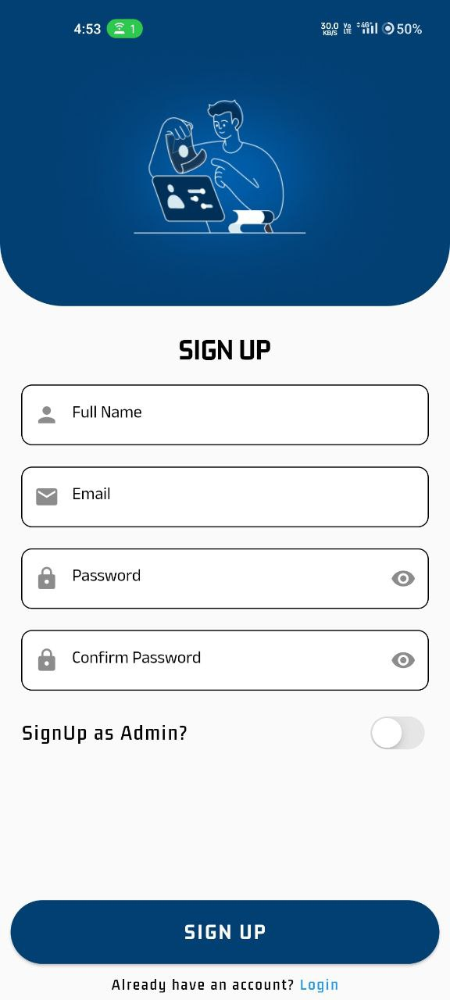
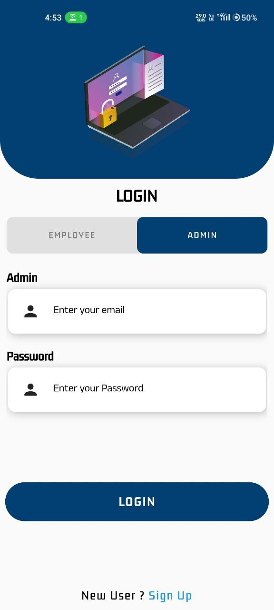

# 
𝑨𝒕𝒕𝒆𝒏𝒅𝒂𝒏𝒄𝒆 𝑨𝒑𝒑✨

 

 

 

 

## What is this 𝑨𝒕𝒕𝒆𝒏𝒅𝒂𝒏𝒄𝒆 𝑨𝒑𝒑?
This is an attendance app created using `flutter` and `firebase` where the user's check-in and check-out time gets stored in firebase database.

## <h1>🧰 Features:</h1>
* Email Authentication.
* Home screen with a slider action button which is used to mark the attendance which then get stored in firestore database. 
* A profile page to store user information to the database. 
* Calendar screen where user can check their own records of attendance.
* Searching/Indexing.
* Timeline.

## <h1>🤔 How it works ?</h1>
1) First user have to register in the signup screen.
2) After registration, login with the registered email.
3) Add the required data in the profile page which gets store in firestore database.
4) Use the slider actiob  button to check in and to check out.
5) To check the records, use the calendar screen where monthly data can be seen.

<H1>TeckStack Used</H1>

🔸Flutter

🔸Firebase Authentication

🔸Firestore Database

## <h1>Screenshots</h1>

<table>
  <tr>
    <td>Signup Page</td>
     <td>Admin Login</td>
     <td>Employee Login</td>
  </tr>
  <tr>
    <td></td>
    <td></td>
    <td></td>
  </tr>
 </table>
 

---

⭐ Go through the contributing guidelines in [CONTRIBUTING](https://github.com/Nikhil636/Attendance-app/blob/main/CONTRIBUTING.md)👩‍💻

## Project Admin
<table>
<tr>
<td align="center">  <h4 style="color:red;">Nikhil Bhartiya</h4></a>
&nbsp;&nbsp;&nbsp;&nbsp;
 &nbsp;&nbsp;&nbsp;&nbsp;
   </td>

</tr>
</table>

## Project Contributors

    <h3>Don't forget to ⭐ this repo</h3>
    <h5>Building with the COMMUNITY for the COMMUNITY ❤️</h5>

